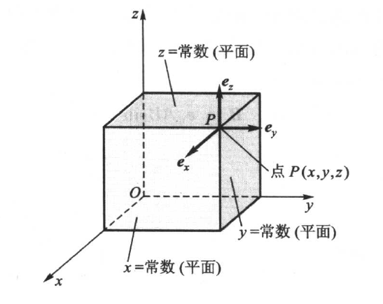
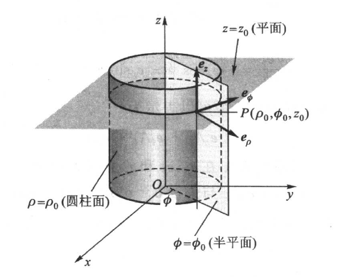
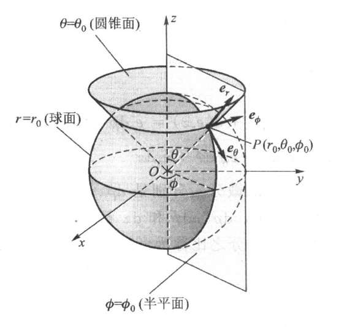

# 1.1 矢量代数

## 1.1.1 矢量与标量

## 1.1.2 矢量的加减法

## 1.1.3 矢量的乘法

### 一、点积

#### 1.定义

$\large A \cdot B=ABcos\theta$

#### 2.性质

$\large A \cdot B=B \cdot A$

$\large A \cdot(B+C)=A\cdot B+A \cdot C$

### 二、叉积

#### 1.定义

$\large A \times B=e_nABsin\theta$

$\large e_n$方向为右手四指从A旋转到B时大拇指的方向（**右手定理**）

#### 2.性质

$\large A \times B=-B \times A$

$\large A \times(B+C)=A\times B+A\times C$

### 三、三重积

$\large A \cdot(B \times C)=B \cdot(C \times A)=C \cdot(A \times B)$

$\large A\times(B \times C)=B(A \cdot C)-C(A \cdot B)$

# 1.2 三种常用的正交坐标系

## 1.2.1 直角坐标系

$\large A=e_xA_x+e_yA_y+e_zA_z \quad B=e_xB_x+e_yB_y+e_zB_z$

$\large A+B=e_x(A_x+B_x)+e_y(A_y+B_y)+e_z(A_z+B_z)$

$\large A \cdot B=A_xB_x+A_yB_y+A_zB_z$

$\large A \times B=\begin{vmatrix} e_x & e_y & e_z \\ A_x & A_y & A_z \\ B_x & B_y & B_z\end{vmatrix}$

## 1.2.2 圆柱坐标系

## 1.2.3 球坐标系

# 1.3 标量场的梯度

## 1.3.1 标量场的等值面

## 1.3.2 方向导数

$\Large {\partial u \over \partial l}={\partial u \over \partial x}cos\alpha+{\partial u \over \partial y}cos\beta+{\partial u \over \partial z}cos\gamma$

## 1.3.3 梯度

### 一、定义

标量场u在点M处的梯度是一个**矢量**，它的方向沿场量u变化率（方向导数）最大的方向，大小等于其最大变化率

$\Large grad\,u=(e_x{\partial \over \partial x}+e_y{\partial \over \partial y}+e_z{\partial \over \partial z})u=\triangledown u$

### 二、性质

在给定点沿任意方向的方向导数等于梯度在该方向上的投影

每一点的梯度垂直于过该点的等值面

# 1.4 矢量场的通量与散度

## 1.4.1 矢量场的矢量线

在矢量线上，任一点的切线方向都与该点的场矢量方向相同

## 1.4.2 通量

$\large dS$为开曲面S上的一个面元，这个开曲面由一条闭合曲线C围城，选择C的绕行方向后，按右手法则规定$\large e_n$的方向

$\large \Psi = \int_S\vec{F}\cdot e_ndS$

当S为闭合曲面时

$\large \Psi = \oint_S\vec{F}\cdot e_ndS$

$\large \Psi>0$时，穿出闭合曲面的通量多于进入的通量，闭合曲面S内必有发出矢量线的源，称之为正通量源

$\large \Psi<0$时，穿出闭合曲面的通量少于进入的通量，闭合曲面S内必有汇集矢量线的源，称之为负通量源

## 1.4.3 散度

$\large div \, \vec{F}=\lim\limits_{\Delta V \to 0}{\oint_S \vec{F}\cdot d\vec{S} \over \Delta V}$

散度表示单位体积内散发出来的矢量的通量

$\large div \, \vec{F}>0$时，为正通量源

$\large div \, \vec{F}<0$时，为负通量源

$\large \Psi = \oint_SF\cdot e_ndS \approx ({\partial F_x \over \partial x}+{\partial F_y \over \partial y}+{\partial F_z \over \partial z})\Delta x\Delta y\Delta z$

$\large div \, \vec{F}=\lim\limits_{\Delta V \to 0}{\oint_S \vec{F}\cdot d\vec{S} \over \Delta V}={\partial F_x \over \partial x}+{\partial F_y \over \partial y}+{\partial F_z \over \partial z}=\triangledown \cdot \vec{F}$

## 1.4.4 散度定理

$\large \int_V\triangledown\cdot \vec{F}dV=\oint_S\vec{F}\cdot d\vec{S}$

# 1.5 矢量场的环流与旋度

## 1.5.1 环流

### 一、环流

矢量场沿场中一条闭合路径C的曲线积分称为环流

$\large \Gamma=\oint_C\vec{F}\cdot d\vec{l}$

如果矢量场的环流不等于0，则认为场中有产生该矢量场的源，但这种源所产生的矢量线是闭合曲线，通常称之为漩涡源

### 二、环流面密度

$\large rot_n\,\vec{F}=\lim\limits_{\Delta S \to 0}{\oint_C\vec{F}\cdot d\vec{l} \over \Delta S}$

## 1.5.2 旋度

矢量场F在点M处的旋度是一个矢量，它的方向沿着使环流面密度取得最大值的面元法线方向，大小等于该环流面密度最大值

$\large rot \, \vec{F}=\vec{n}\lim\limits_{\Delta S \to 0}{1 \over \Delta S}\oint_C\vec{F}\cdot d\vec{l}|_{max}=\triangledown \times \vec{F}=\begin{vmatrix} e_x & e_y & e_z \\ {\partial \over \partial x} & {\partial \over \partial y} & {\partial \over \partial z} \\ F_x & F_y & F_z\end{vmatrix}$

## 1.5.3 斯托克斯定理

$\large \int_S \triangledown \times \vec{F} \cdot d\vec{S}=\oint_C \vec{F} \cdot d\vec{l}$

矢量场的旋度在曲面上的面积分等于矢量场在限定曲面的闭合曲线上的线积分

# 1.6 无旋场与无散场

## 1.6.1 无旋场

如果一个矢量场F的旋度处处为0，则该场为无旋场

标量场的梯度的旋度恒为0

## 1.6.2 无散场

如果一个矢量场F的散度处处为0，则该场为无散场

矢量场的旋度的散度恒为0

# 1.7 拉普拉斯运算与格林定理

## 1.7.1 拉普拉斯运算

## 1.7.2 格林定理

# 1.8 亥姆霍兹定理